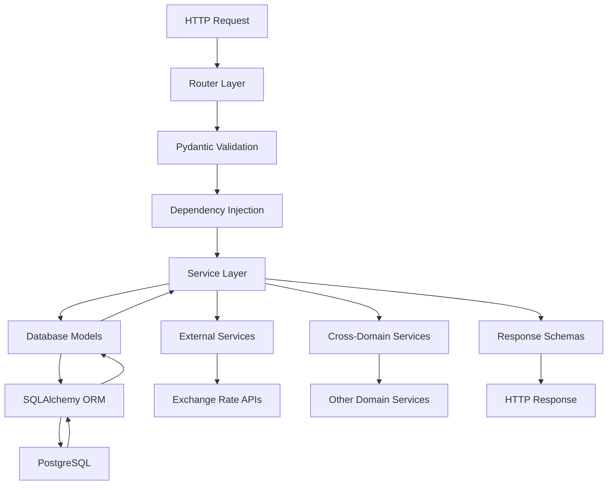

# Backend Architecture

Colony's backend follows a modular, domain-driven architecture using FastAPI with clear separation of concerns and industry best practices.

## Architecture Overview

The backend is built using **FastAPI** with a **domain-driven design** approach, where each business domain (auth, expenses, cycles, etc.) is organized as a self-contained module with its own models, schemas, services, and routes.

### Key Principles

- **Domain-Driven Design**: Each business domain is a separate module
- **Separation of Concerns**: Clear boundaries between layers (routes, services, data)
- **Dependency Injection**: Clean dependency management
- **Type Safety**: Full type annotations with Pydantic
- **Testing**: Comprehensive test coverage per domain

## Project Structure

```
backend/
├── alembic/                    # Database migrations
│   ├── versions/
│   └── env.py
├── app/                        # Main application source
│   ├── auth/                   # Authentication domain
│   │   ├── router.py           # Auth API routes
│   │   ├── schemas.py          # Pydantic request/response models
│   │   ├── models.py           # SQLAlchemy database models
│   │   ├── dependencies.py     # Auth-specific dependencies
│   │   ├── service.py          # Authentication business logic
│   │   ├── config.py           # Auth configuration (JWT settings)
│   │   ├── constants.py        # Auth constants and error codes
│   │   ├── exceptions.py       # Auth-specific exceptions
│   │   └── utils.py            # Auth utility functions
│   ├── payment_methods/        # Payment methods domain
│   │   ├── router.py
│   │   ├── schemas.py
│   │   ├── models.py
│   │   ├── dependencies.py
│   │   ├── service.py
│   │   ├── constants.py
│   │   ├── exceptions.py
│   │   └── utils.py
│   ├── expense_templates/      # Expense templates domain
│   │   ├── router.py
│   │   ├── schemas.py
│   │   ├── models.py
│   │   ├── dependencies.py
│   │   ├── service.py
│   │   ├── constants.py
│   │   ├── exceptions.py
│   │   └── utils.py
│   ├── cycles/                 # Cycle management domain
│   │   ├── router.py
│   │   ├── schemas.py
│   │   ├── models.py
│   │   ├── dependencies.py
│   │   ├── service.py
│   │   ├── constants.py
│   │   ├── exceptions.py
│   │   └── utils.py
│   ├── expenses/               # Individual expenses domain
│   │   ├── router.py
│   │   ├── schemas.py
│   │   ├── models.py
│   │   ├── dependencies.py
│   │   ├── service.py
│   │   ├── constants.py
│   │   ├── exceptions.py
│   │   └── utils.py
│   ├── reports/                # Analytics and reporting domain
│   │   ├── router.py
│   │   ├── schemas.py
│   │   ├── service.py
│   │   ├── constants.py
│   │   ├── exceptions.py
│   │   └── utils.py
│   ├── exchange_rates/         # Currency exchange domain
│   │   ├── client.py           # External API client
│   │   ├── schemas.py
│   │   ├── models.py
│   │   ├── service.py
│   │   ├── config.py
│   │   ├── constants.py
│   │   ├── exceptions.py
│   │   └── utils.py
│   ├── config.py               # Global application configuration
│   ├── database.py             # Database connection and session management
│   ├── models.py               # Global database models and base classes
│   ├── exceptions.py           # Global exception classes
│   ├── dependencies.py         # Global dependencies (DB session, current user)
│   ├── pagination.py           # Pagination utilities
│   └── main.py                 # FastAPI application factory
├── tests/                      # Test suite organized by domain
│   ├── auth/
│   ├── payment_methods/
│   ├── expense_templates/
│   ├── cycles/
│   ├── expenses/
│   ├── reports/
│   ├── exchange_rates/
│   ├── conftest.py            # Pytest configuration and fixtures
│   └── utils.py               # Test utilities
├── .env                       # Environment variables
├── alembic.ini                # Alembic configuration
├── pyproject.toml             # Project configuration and dependencies
└── README.md
```

## Domain Architecture

Each domain follows a consistent internal structure with clear responsibilities:

### File Responsibilities

#### router.py
Contains all HTTP endpoints for the domain. Handles request/response, validation, and delegates business logic to services.

```python
# Example: app/cycles/router.py
from fastapi import APIRouter, Depends, HTTPException
from sqlalchemy.orm import Session

from app.dependencies import get_db, get_current_user
from app.auth.models import User
from . import service, schemas

router = APIRouter(prefix="/cycles", tags=["cycles"])

@router.post("/", response_model=schemas.CycleResponse)
async def create_cycle(
    cycle_data: schemas.CycleCreate,
    db: Session = Depends(get_db),
    current_user: User = Depends(get_current_user)
):
    return await service.create_cycle(db, cycle_data, current_user.id)
```

#### schemas.py
Pydantic models for request/response validation and serialization.

```python
# Example: app/cycles/schemas.py
from datetime import date
from decimal import Decimal
from typing import Optional
from pydantic import BaseModel

class CycleCreate(BaseModel):
    name: str
    start_date: date
    end_date: date
    income_amount: Decimal
    generate_from_templates: bool = True

class CycleResponse(BaseModel):
    id: str
    name: str
    start_date: date
    end_date: date
    income_amount: Decimal
    status: str
    created_at: datetime

    class Config:
        from_attributes = True
```

#### models.py
SQLAlchemy database models representing the domain's data structure.

```python
# Example: app/cycles/models.py
from sqlalchemy import Column, String, Date, DECIMAL, ForeignKey
from sqlalchemy.dialects.postgresql import UUID, ENUM
from sqlalchemy.orm import relationship

from app.models import BaseModel, CycleStatus

class Cycle(BaseModel):
    __tablename__ = "cycles"

    name = Column(String(100), nullable=False)
    user_id = Column(UUID(as_uuid=True), ForeignKey("users.id"), nullable=False)
    start_date = Column(Date, nullable=False)
    end_date = Column(Date, nullable=False)
    income_amount = Column(DECIMAL(10, 2), default=0)
    status = Column(ENUM(CycleStatus), default=CycleStatus.DRAFT)

    # Relationships
    user = relationship("User", back_populates="cycles")
    expenses = relationship("CycleExpense", back_populates="cycle")
```

#### service.py
Contains the domain's business logic, data processing, and complex operations.

```python
# Example: app/cycles/service.py
from sqlalchemy.orm import Session
from typing import List

from . import models, schemas
from ..expense_templates import service as template_service
from ..expenses import service as expense_service

async def create_cycle(
    db: Session,
    cycle_data: schemas.CycleCreate,
    user_id: str
) -> models.Cycle:
    """Create a new cycle and optionally generate expenses from templates."""

    # Create cycle
    cycle = models.Cycle(
        name=cycle_data.name,
        user_id=user_id,
        start_date=cycle_data.start_date,
        end_date=cycle_data.end_date,
        income_amount=cycle_data.income_amount
    )

    db.add(cycle)
    db.flush()  # Get cycle ID

    # Generate expenses from templates if requested
    if cycle_data.generate_from_templates:
        await _generate_expenses_from_templates(db, cycle)

    db.commit()
    return cycle
```

#### dependencies.py
Domain-specific dependencies for dependency injection.

```python
# Example: app/cycles/dependencies.py
from fastapi import Depends, HTTPException
from sqlalchemy.orm import Session

from app.dependencies import get_db, get_current_user
from app.auth.models import User
from . import service
from .constants import ErrorCode

async def get_cycle_by_id(
    cycle_id: str,
    db: Session = Depends(get_db),
    current_user: User = Depends(get_current_user)
):
    """Dependency to get cycle by ID and verify ownership."""
    cycle = await service.get_cycle_by_id(db, cycle_id, current_user.id)
    if not cycle:
        raise HTTPException(
            status_code=404,
            detail=ErrorCode.CYCLE_NOT_FOUND
        )
    return cycle
```

#### constants.py
Domain-specific constants, error codes, and enums.

```python
# Example: app/cycles/constants.py
from enum import Enum

class ErrorCode:
    CYCLE_NOT_FOUND = "CYCLE_NOT_FOUND"
    CYCLE_ALREADY_COMPLETED = "CYCLE_ALREADY_COMPLETED"
    INVALID_CYCLE_DATES = "INVALID_CYCLE_DATES"
    CYCLE_NAME_EXISTS = "CYCLE_NAME_EXISTS"

class CycleStatus(str, Enum):
    DRAFT = "draft"
    ACTIVE = "active"
    COMPLETED = "completed"

# Business constants
MAX_CYCLE_DURATION_DAYS = 45
DEFAULT_CYCLE_DURATION_DAYS = 42  # 6 weeks
```

#### exceptions.py
Domain-specific exception classes.

```python
# Example: app/cycles/exceptions.py
from app.exceptions import AppException
from .constants import ErrorCode

class CycleNotFoundException(AppException):
    def __init__(self):
        super().__init__(
            error_code=ErrorCode.CYCLE_NOT_FOUND,
            message="Cycle not found",
            status_code=404
        )

class CycleAlreadyCompletedException(AppException):
    def __init__(self):
        super().__init__(
            error_code=ErrorCode.CYCLE_ALREADY_COMPLETED,
            message="Cannot modify completed cycle",
            status_code=409
        )
```

#### utils.py
Domain-specific utility functions that don't contain business logic.

```python
# Example: app/cycles/utils.py
from datetime import date, timedelta
from typing import Tuple

def calculate_cycle_dates(start_date: date) -> Tuple[date, date]:
    """Calculate 6-week cycle end date from start date."""
    end_date = start_date + timedelta(days=42)  # 6 weeks
    return start_date, end_date

def format_cycle_name(start_date: date, end_date: date) -> str:
    """Generate a descriptive cycle name from dates."""
    return f"{start_date.strftime('%B %Y')} Cycle"
```

## Global Architecture Components

### app/main.py
Application factory that initializes FastAPI with all domain routers.

```python
from fastapi import FastAPI
from fastapi.middleware.cors import CORSMiddleware

from app.config import settings
from app.auth.router import router as auth_router
from app.cycles.router import router as cycles_router
from app.expenses.router import router as expenses_router
# ... other routers

def create_app() -> FastAPI:
    app = FastAPI(
        title="Colony API",
        version="1.0.0",
        description="Personal expense management API"
    )

    # Middleware
    app.add_middleware(
        CORSMiddleware,
        allow_origins=settings.ALLOWED_HOSTS,
        allow_credentials=True,
        allow_methods=["*"],
        allow_headers=["*"],
    )

    # Include domain routers
    app.include_router(auth_router, prefix="/api/v1")
    app.include_router(cycles_router, prefix="/api/v1")
    app.include_router(expenses_router, prefix="/api/v1")

    return app

app = create_app()
```

### app/database.py
Database connection and session management.

```python
from sqlalchemy import create_engine
from sqlalchemy.ext.declarative import declarative_base
from sqlalchemy.orm import sessionmaker

from app.config import settings

engine = create_engine(settings.DATABASE_URL)
SessionLocal = sessionmaker(autocommit=False, autoflush=False, bind=engine)

Base = declarative_base()

def get_db():
    """Database session dependency."""
    db = SessionLocal()
    try:
        yield db
    finally:
        db.close()
```

### app/models.py
Base model classes and global models.

```python
from sqlalchemy import Column, DateTime, Boolean
from sqlalchemy.dialects.postgresql import UUID
from sqlalchemy.ext.declarative import declarative_base
from datetime import datetime
import uuid

Base = declarative_base()

class BaseModel(Base):
    """Base model with common fields."""
    __abstract__ = True

    id = Column(UUID(as_uuid=True), primary_key=True, default=uuid.uuid4)
    created_at = Column(DateTime, default=datetime.utcnow)
    updated_at = Column(DateTime, default=datetime.utcnow, onupdate=datetime.utcnow)
    active = Column(Boolean, default=True)
```

### app/dependencies.py
Global dependencies used across domains.

```python
from fastapi import Depends, HTTPException, status
from fastapi.security import HTTPBearer
from sqlalchemy.orm import Session

from app.database import get_db
from app.auth import service as auth_service

security = HTTPBearer()

async def get_current_user(
    token: str = Depends(security),
    db: Session = Depends(get_db)
):
    """Get current authenticated user from JWT token."""
    user = await auth_service.get_user_from_token(db, token.credentials)
    if not user:
        raise HTTPException(
            status_code=status.HTTP_401_UNAUTHORIZED,
            detail="Invalid authentication credentials"
        )
    return user
```

## Cross-Domain Communication

When domains need to interact, they import services explicitly:

```python
# In app/cycles/service.py
from app.expense_templates import service as template_service
from app.expenses import service as expense_service
from app.exchange_rates import service as exchange_service

async def create_cycle_with_expenses(db: Session, cycle_data: schemas.CycleCreate):
    # Get user's templates
    templates = await template_service.get_active_templates(db, cycle_data.user_id)

    # Generate expenses for each template
    for template in templates:
        expenses = await expense_service.generate_from_template(
            db, template, cycle_data.start_date, cycle_data.end_date
        )

        # Convert currencies if needed
        for expense in expenses:
            if expense.currency != "USD":
                usd_amount = await exchange_service.convert_to_usd(
                    expense.amount, expense.currency
                )
                expense.amount_usd = usd_amount
```

## Data Flow Architecture



## Key Architecture Benefits

### 1. **Modularity**
- Each domain is self-contained
- Easy to add new features without affecting other domains
- Clear boundaries and responsibilities

### 2. **Testability**
- Each layer can be tested independently
- Mock dependencies easily
- Domain-specific test suites

### 3. **Maintainability**
- Consistent structure across domains
- Easy to locate and modify code
- Clear separation of concerns

### 4. **Scalability**
- Domains can be extracted to microservices if needed
- Independent development by different teams
- Horizontal scaling capabilities

### 5. **Type Safety**
- Full type annotations
- Pydantic validation
- SQLAlchemy type mapping

This architecture provides a solid foundation for building a maintainable, scalable, and well-tested expense management API while following FastAPI and Python best practices.
