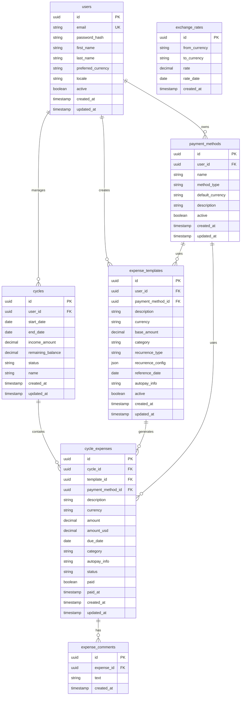

# Database Schema

Colony uses PostgreSQL for reliable financial data management with ACID transactions and complex relationship queries.

## Database Choice: PostgreSQL

- **ACID Compliance**: Essential for financial data integrity
- **Complex Queries**: Supports advanced reporting and analytics
- **JSON Support**: Flexible configuration storage (recurrence patterns)
- **Decimal Precision**: Accurate financial calculations
- **Mature Ecosystem**: Well-supported with excellent tooling
- **Full-Text Search**: Advanced comment search capabilities

## Schema Overview



## Global Types

Before creating tables, we define custom types that ensure data consistency across the schema:

```sql
-- ===========================================
-- GLOBAL ENUMS (Create these first)
-- ===========================================

-- Supported currencies (ISO 4217 codes)
CREATE TYPE currency_code AS ENUM ('USD', 'MXN');

-- Payment method types
CREATE TYPE payment_method_type AS ENUM ('debit', 'credit', 'cash', 'transfer');

-- Expense categorization
CREATE TYPE expense_category AS ENUM ('fixed', 'variable');

-- Template recurrence patterns
CREATE TYPE recurrence_type AS ENUM ('weekly', 'bi_weekly', 'monthly', 'custom');

-- Cycle lifecycle states
CREATE TYPE cycle_status AS ENUM ('draft', 'active', 'completed');

-- Individual expense states
CREATE TYPE expense_status AS ENUM ('pending', 'paid', 'cancelled', 'overdue');
```

### ENUM Descriptions

| Type | Values | Description |
|------|--------|-------------|
| `currency_code` | `USD`, `MXN` | ISO 4217 currency codes for supported currencies |
| `payment_method_type` | `debit`, `credit`, `cash`, `transfer` | Types of payment methods available |
| `expense_category` | `fixed`, `variable` | Expense categorization for budgeting |
| `recurrence_type` | `weekly`, `bi_weekly`, `monthly`, `custom` | How often template expenses recur |
| `cycle_status` | `draft`, `active`, `completed` | Lifecycle state of expense cycles |
| `expense_status` | `pending`, `paid`, `cancelled`, `overdue` | Current state of individual expenses |

## Table Definitions

### Users
Primary user accounts for the application.

```sql
CREATE TABLE users (
    id UUID PRIMARY KEY DEFAULT gen_random_uuid(),
    email VARCHAR(255) UNIQUE NOT NULL,
    password_hash VARCHAR(255) NOT NULL,
    first_name VARCHAR(100),
    last_name VARCHAR(100),
    preferred_currency currency_code DEFAULT 'USD',  -- Uses global ENUM
    locale VARCHAR(10) DEFAULT 'en-US',
    active BOOLEAN DEFAULT true,
    created_at TIMESTAMP WITH TIME ZONE DEFAULT NOW(),
    updated_at TIMESTAMP WITH TIME ZONE DEFAULT NOW()
);

CREATE INDEX idx_users_email ON users(email);
CREATE INDEX idx_users_active ON users(active);
```

### Payment Methods
User-defined payment methods (cards, accounts, cash).

```sql
CREATE TABLE payment_methods (
    id UUID PRIMARY KEY DEFAULT gen_random_uuid(),
    user_id UUID NOT NULL REFERENCES users(id) ON DELETE CASCADE,
    name VARCHAR(100) NOT NULL,
    method_type payment_method_type NOT NULL,        -- Uses global ENUM
    default_currency currency_code NOT NULL,         -- Uses global ENUM
    description TEXT,
    active BOOLEAN DEFAULT true,
    created_at TIMESTAMP WITH TIME ZONE DEFAULT NOW(),
    updated_at TIMESTAMP WITH TIME ZONE DEFAULT NOW(),

    CONSTRAINT unique_user_payment_method_name UNIQUE(user_id, name)
);

CREATE INDEX idx_payment_methods_user_id ON payment_methods(user_id);
CREATE INDEX idx_payment_methods_active ON payment_methods(active);
```

### Expense Templates
Reusable templates for recurring expenses.

```sql
CREATE TABLE expense_templates (
    id UUID PRIMARY KEY DEFAULT gen_random_uuid(),
    user_id UUID NOT NULL REFERENCES users(id) ON DELETE CASCADE,
    payment_method_id UUID NOT NULL REFERENCES payment_methods(id),
    description VARCHAR(255) NOT NULL,
    currency currency_code NOT NULL,
    base_amount DECIMAL(10,2) NOT NULL CHECK (base_amount > 0),
    category expense_category NOT NULL,
    recurrence_type recurrence_type NOT NULL,
    recurrence_config JSONB NOT NULL DEFAULT '{}',
    reference_date DATE NOT NULL,  -- Last known occurrence (e.g., "1/12/2025 - last insurance bill")
    autopay_info TEXT,
    active BOOLEAN DEFAULT true,
    created_at TIMESTAMP WITH TIME ZONE DEFAULT NOW(),
    updated_at TIMESTAMP WITH TIME ZONE DEFAULT NOW()
);

CREATE INDEX idx_expense_templates_user_id ON expense_templates(user_id);
CREATE INDEX idx_expense_templates_active ON expense_templates(active);
CREATE INDEX idx_expense_templates_category ON expense_templates(category);
```

### Cycles
6-week expense management periods.

```sql
CREATE TABLE cycles (
    id UUID PRIMARY KEY DEFAULT gen_random_uuid(),
    user_id UUID NOT NULL REFERENCES users(id) ON DELETE CASCADE,
    name VARCHAR(100) NOT NULL,
    start_date DATE NOT NULL,
    end_date DATE NOT NULL,
    income_amount DECIMAL(10,2) NOT NULL DEFAULT 0,
    remaining_balance DECIMAL(10,2) NOT NULL DEFAULT 0,
    status cycle_status DEFAULT 'draft',
    created_at TIMESTAMP WITH TIME ZONE DEFAULT NOW(),
    updated_at TIMESTAMP WITH TIME ZONE DEFAULT NOW(),

    CONSTRAINT valid_cycle_dates CHECK (end_date > start_date),
    CONSTRAINT unique_user_cycle_name UNIQUE(user_id, name)
);

CREATE INDEX idx_cycles_user_id ON cycles(user_id);
CREATE INDEX idx_cycles_status ON cycles(status);
CREATE INDEX idx_cycles_dates ON cycles(start_date, end_date);
```

### Cycle Expenses
Individual expenses within a cycle.

```sql
CREATE TABLE cycle_expenses (
    id UUID PRIMARY KEY DEFAULT gen_random_uuid(),
    cycle_id UUID NOT NULL REFERENCES cycles(id) ON DELETE CASCADE,
    template_id UUID REFERENCES expense_templates(id),
    payment_method_id UUID NOT NULL REFERENCES payment_methods(id),
    description VARCHAR(255) NOT NULL,
    currency currency_code NOT NULL,
    amount DECIMAL(10,2) NOT NULL CHECK (amount > 0),
    amount_usd DECIMAL(10,2) NOT NULL CHECK (amount_usd > 0),
    due_date DATE NOT NULL,
    category expense_category NOT NULL,
    autopay_info TEXT,
    status expense_status DEFAULT 'pending',
    paid BOOLEAN DEFAULT false,
    paid_at TIMESTAMP WITH TIME ZONE,
    created_at TIMESTAMP WITH TIME ZONE DEFAULT NOW(),
    updated_at TIMESTAMP WITH TIME ZONE DEFAULT NOW()
);

CREATE INDEX idx_cycle_expenses_cycle_id ON cycle_expenses(cycle_id);
CREATE INDEX idx_cycle_expenses_template_id ON cycle_expenses(template_id);
CREATE INDEX idx_cycle_expenses_due_date ON cycle_expenses(due_date);
CREATE INDEX idx_cycle_expenses_status ON cycle_expenses(status);
CREATE INDEX idx_cycle_expenses_paid ON cycle_expenses(paid);
```

### Expense Comments
Detailed comment history and notes for expenses.

```sql
CREATE TABLE expense_comments (
    id UUID PRIMARY KEY DEFAULT gen_random_uuid(),
    expense_id UUID NOT NULL REFERENCES cycle_expenses(id) ON DELETE CASCADE,
    text TEXT NOT NULL,
    created_at TIMESTAMP WITH TIME ZONE DEFAULT NOW(),

    CONSTRAINT comment_text_length CHECK (char_length(text) >= 1 AND char_length(text) <= 2000)
);

CREATE INDEX idx_expense_comments_expense_id ON expense_comments(expense_id);
CREATE INDEX idx_expense_comments_created_at ON expense_comments(created_at);
-- Full-text search index for comment text
CREATE INDEX idx_expense_comments_text_search ON expense_comments USING GIN (to_tsvector('english', text));
```

### Exchange Rates
Currency conversion rates for financial calculations.

```sql
CREATE TABLE exchange_rates (
    id UUID PRIMARY KEY DEFAULT gen_random_uuid(),
    from_currency currency_code NOT NULL,
    to_currency currency_code NOT NULL,
    rate DECIMAL(10,6) NOT NULL CHECK (rate > 0),
    rate_date DATE NOT NULL,
    created_at TIMESTAMP WITH TIME ZONE DEFAULT NOW(),

    CONSTRAINT unique_currency_date UNIQUE(from_currency, to_currency, rate_date)
);

CREATE INDEX idx_exchange_rates_currencies ON exchange_rates(from_currency, to_currency);
CREATE INDEX idx_exchange_rates_date ON exchange_rates(rate_date);
```

## Comments System

The comments system provides a comprehensive way to track notes, changes, and important information about expenses using a dedicated table for full history tracking.

### Comment Features

#### Comment Structure
- **Text content**: 1-2000 character comments
- **Full history**: Complete audit trail of all comment changes
- **Chronological order**: Comments ordered by creation time
- **Full-text search**: PostgreSQL's advanced text search capabilities

#### Current Comment Display
The API determines the "current" comment by selecting the most recent comment for each expense:

```sql
-- Get current comment for an expense
SELECT
    text,
    created_at as last_updated
FROM expense_comments
WHERE expense_id = $1
ORDER BY created_at DESC
LIMIT 1;
```

### Comment History Management

The `expense_comments` table provides complete comment history:

```sql
-- Example comment history for an expense
SELECT
    id,
    text,
    created_at
FROM expense_comments
WHERE expense_id = '123e4567-e89b-12d3-a456-426614174005'
ORDER BY created_at DESC;
```

**Example history:**
```
id                                   | text                                    | created_at
comment-uuid-3                       | Payment delayed due to bank processing | 2025-01-20T14:45:00Z
comment-uuid-2                       | Amount increased by $50 due to inflation| 2025-01-15T10:30:00Z
comment-uuid-1                       | Standard monthly payment                | 2024-12-15T10:00:00Z
```

## Relationship Details

### User → Payment Methods (1:N)
- Users can have multiple payment methods
- Payment methods belong to one user
- Soft delete preserves historical data

### User → Expense Templates (1:N)
- Users create multiple templates
- Templates define recurring expense patterns
- Templates reference payment methods

### User → Cycles (1:N)
- Users manage multiple 6-week cycles
- Each cycle has defined start/end dates
- Cycles track income and remaining balance

### Cycle → Cycle Expenses (1:N)
- Each cycle contains multiple expenses
- Expenses can be generated from templates
- Manual expenses allowed within cycles

### Cycle Expenses → Expense Comments (1:N)
- Each expense can have multiple comments
- Comments provide detailed history and notes
- Full-text search enabled for comment content

### Template → Cycle Expenses (1:N)
- Templates can generate multiple expenses across cycles
- Relationship tracks which template generated each expense
- Optional relationship (manual expenses have NULL template_id)

## Comment Search Capabilities

### Full-Text Search Examples

```sql
-- Search comments containing specific words
SELECT DISTINCT ce.*
FROM cycle_expenses ce
JOIN expense_comments ec ON ce.id = ec.expense_id
WHERE to_tsvector('english', ec.text) @@ plainto_tsquery('english', 'inflation increase');

-- Find expenses with comments containing multiple keywords
SELECT DISTINCT ce.*
FROM cycle_expenses ce
JOIN expense_comments ec ON ce.id = ec.expense_id
WHERE to_tsvector('english', ec.text) @@ to_tsquery('english', 'inflation & increase');

-- Search for expenses with comments in a specific time period
SELECT DISTINCT ce.*
FROM cycle_expenses ce
JOIN expense_comments ec ON ce.id = ec.expense_id
WHERE ec.created_at >= '2025-01-01'
  AND ec.created_at < '2025-02-01'
  AND to_tsvector('english', ec.text) @@ plainto_tsquery('english', 'adjustment');
```

### Comment Analytics Queries

```sql
-- Expenses with most comments (indicating complex situations)
SELECT
    ce.description,
    ce.amount,
    COUNT(ec.id) as comment_count,
    MAX(ec.created_at) as latest_comment
FROM cycle_expenses ce
LEFT JOIN expense_comments ec ON ce.id = ec.expense_id
GROUP BY ce.id, ce.description, ce.amount
HAVING COUNT(ec.id) > 0
ORDER BY comment_count DESC;

-- Recent comment activity for a cycle
SELECT
    ce.description,
    ec.text,
    ec.created_at
FROM cycle_expenses ce
JOIN expense_comments ec ON ce.id = ec.expense_id
WHERE ce.cycle_id = $1
  AND ec.created_at >= NOW() - INTERVAL '7 days'
ORDER BY ec.created_at DESC;

-- Expenses with comments but no recent activity (may need attention)
SELECT
    ce.description,
    ce.amount,
    ce.due_date,
    ce.status,
    COUNT(ec.id) as comment_count,
    MAX(ec.created_at) as last_comment_date
FROM cycle_expenses ce
LEFT JOIN expense_comments ec ON ce.id = ec.expense_id
WHERE ce.cycle_id = $1
GROUP BY ce.id, ce.description, ce.amount, ce.due_date, ce.status
HAVING COUNT(ec.id) > 0
   AND MAX(ec.created_at) < NOW() - INTERVAL '30 days'
ORDER BY last_comment_date ASC;
```

## Recurrence Configuration Schema

The `recurrence_config` JSONB field stores type-specific configuration for calculating expense occurrences. The schema varies based on the `recurrence_type`.

### Weekly Recurrence

For expenses that occur on a specific day of the week (e.g., every Saturday for groceries).

```json
{
  "day_of_week": 6
}
```

**Schema:**
- `day_of_week` (integer, required): Day of the week (0=Sunday, 1=Monday, ..., 6=Saturday)

**Examples:**
```json
// Every Saturday (groceries)
{
  "day_of_week": 6
}

// Every Tuesday (therapy appointment)
{
  "day_of_week": 2
}
```

**Calculation Logic:**
1. Find the first occurrence of `day_of_week` on or after cycle start date
2. Generate weekly occurrences until cycle end date
3. Reference date is used to validate the pattern matches historical data

### Bi-Weekly Recurrence

For expenses that occur every 14 days, typically aligned with pay cycles.

```json
{
  "interval_days": 14
}
```

**Schema:**
- `interval_days` (integer, required): Number of days between occurrences (typically 14)

**Examples:**
```json
// Every 14 days (bi-weekly paycheck deductions)
{
  "interval_days": 14
}

// Every 10 days (custom medication refill)
{
  "interval_days": 10
}
```

**Calculation Logic:**
1. Start from reference date
2. Add/subtract `interval_days` to find occurrences within cycle period
3. Generate all dates that fall within cycle start/end dates

### Monthly Recurrence

For expenses that occur on the same day each month (e.g., rent, utilities).

```json
{
  "day_of_month": 15
}
```

**Schema:**
- `day_of_month` (integer, required): Day of the month (1-31)
- `handle_month_end` (boolean, optional): How to handle months with fewer days (default: false)

**Examples:**
```json
// 1st of every month (rent)
{
  "day_of_month": 1
}

// 15th of every month (credit card payment)
{
  "day_of_month": 15
}

// Last day of month (salary)
{
  "day_of_month": 31,
  "handle_month_end": true
}
```

**Calculation Logic:**
1. For each month that overlaps with cycle period
2. Use `day_of_month` as the occurrence date
3. If `handle_month_end` is true and `day_of_month` > days in month, use last day of month
4. Skip months where the calculated date is outside cycle period

### Custom Recurrence

For complex patterns like quarterly, semi-annual, or irregular intervals.

```json
{
  "interval": 3,
  "unit": "months",
  "day_of_month": 15
}
```

**Schema:**
- `interval` (integer, required): Number of units between occurrences
- `unit` (string, required): Time unit - one of: "days", "weeks", "months", "years"
- `day_of_month` (integer, optional): Specific day for month/year units (1-31)
- `month_of_year` (integer, optional): Specific month for year units (1-12)
- `day_of_week` (integer, optional): Specific day for week units (0-6)

**Examples:**
```json
// Every 3 months on the 15th (quarterly insurance)
{
  "interval": 3,
  "unit": "months",
  "day_of_month": 15
}

// Every 2 months on the 1st (bi-monthly subscription)
{
  "interval": 2,
  "unit": "months",
  "day_of_month": 1
}

// Every 6 months on the 1st (semi-annual payment)
{
  "interval": 6,
  "unit": "months",
  "day_of_month": 1
}

// Every 45 days (custom interval)
{
  "interval": 45,
  "unit": "days"
}

// Annually on January 1st (yearly subscription)
{
  "interval": 1,
  "unit": "years",
  "day_of_month": 1,
  "month_of_year": 1
}

// Every 3 weeks on Wednesday
{
  "interval": 3,
  "unit": "weeks",
  "day_of_week": 3
}
```

## Key Design Decisions

### 1. Multi-Currency Support
- Native currency storage on each expense
- Automatic USD conversion for reporting
- Historical exchange rate tracking

### 2. Soft Deletes
- `active` flags instead of hard deletes
- Preserves financial audit trails
- Maintains referential integrity

### 3. JSONB for Configuration
- Flexible recurrence pattern storage
- PostgreSQL's JSONB provides indexing and querying
- Schema evolution without migrations

### 4. Temporal Data
- Created/updated timestamps on all tables
- `paid_at` timestamp for expense tracking
- Date-based cycle management
- Comment history with full timestamps

### 5. Constraints and Validation
- Check constraints for positive amounts
- Unique constraints for business rules
- Foreign key cascades for data cleanup
- Text length limits for comments

### 6. Comments-Only Approach
- Dedicated table for full comment history
- No legacy JSONB comments field
- Full-text search capabilities
- Clean, normalized design

## Sample Queries

### Generate Cycle Summary with Comment Insights
```sql
SELECT
    c.name,
    c.income_amount,
    COUNT(DISTINCT ce.id) as total_expenses,
    SUM(ce.amount_usd) as total_amount_usd,
    SUM(CASE WHEN ce.category = 'fixed' THEN ce.amount_usd ELSE 0 END) as fixed_expenses,
    SUM(CASE WHEN ce.category = 'variable' THEN ce.amount_usd ELSE 0 END) as variable_expenses,
    c.income_amount - SUM(ce.amount_usd) as net_balance,
    COUNT(ec.id) as total_comments,
    COUNT(DISTINCT CASE WHEN ec.id IS NOT NULL THEN ce.id END) as expenses_with_comments
FROM cycles c
LEFT JOIN cycle_expenses ce ON c.id = ce.cycle_id
LEFT JOIN expense_comments ec ON ce.id = ec.expense_id
WHERE c.user_id = $1 AND c.id = $2
GROUP BY c.id, c.name, c.income_amount;
```

### Payment Method Summary with Comment Analysis
```sql
SELECT
    pm.name,
    pm.method_type,
    COUNT(DISTINCT ce.id) as expense_count,
    SUM(ce.amount_usd) as total_amount,
    SUM(CASE WHEN ce.paid THEN ce.amount_usd ELSE 0 END) as paid_amount,
    SUM(CASE WHEN NOT ce.paid THEN ce.amount_usd ELSE 0 END) as pending_amount,
    COUNT(ec.id) as comment_count
FROM payment_methods pm
LEFT JOIN cycle_expenses ce ON pm.id = ce.payment_method_id
LEFT JOIN expense_comments ec ON ce.id = ec.expense_id
WHERE pm.user_id = $1 AND ce.cycle_id = $2
GROUP BY pm.id, pm.name, pm.method_type
ORDER BY total_amount DESC;
```

### Expenses Requiring Attention (Based on Comment Activity)
```sql
SELECT
    ce.description,
    ce.amount,
    ce.due_date,
    ce.status,
    COUNT(ec.id) as comment_count,
    MAX(ec.created_at) as latest_comment_date,
    (SELECT text FROM expense_comments
     WHERE expense_id = ce.id
     ORDER BY created_at DESC LIMIT 1) as current_comment
FROM cycle_expenses ce
LEFT JOIN expense_comments ec ON ce.id = ec.expense_id
WHERE ce.cycle_id = $1
GROUP BY ce.id, ce.description, ce.amount, ce.due_date, ce.status
HAVING COUNT(ec.id) > 2  -- Expenses with many comments indicating complexity
ORDER BY latest_comment_date DESC NULLS LAST;
```

### Expenses with Current Comments (for API responses)
```sql
SELECT
    ce.*,
    latest_comment.text as current_comment_text,
    latest_comment.created_at as current_comment_updated
FROM cycle_expenses ce
LEFT JOIN LATERAL (
    SELECT text, created_at
    FROM expense_comments ec
    WHERE ec.expense_id = ce.id
    ORDER BY ec.created_at DESC
    LIMIT 1
) latest_comment ON true
WHERE ce.cycle_id = $1;
```

This clean schema design removes all legacy comment fields and focuses on the dedicated `expense_comments` table for all comment functionality. This provides better data normalization, full comment history, and powerful search capabilities without the complexity of maintaining dual comment systems.
