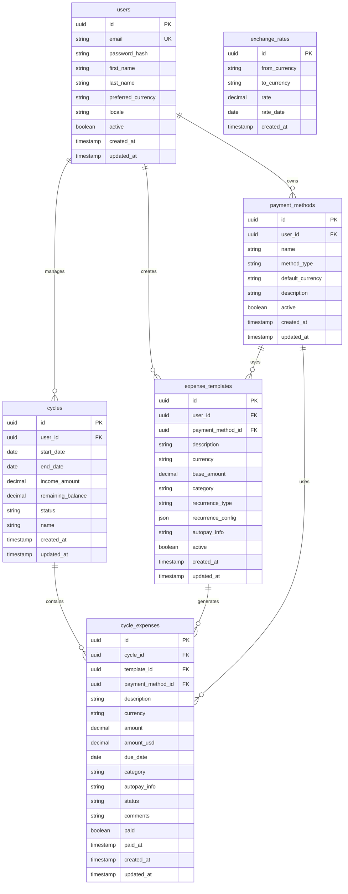

# Database Schema

Colony uses PostgreSQL for reliable financial data management with ACID transactions and complex relationship queries.

## Database Choice: PostgreSQL

- **ACID Compliance**: Essential for financial data integrity
- **Complex Queries**: Supports advanced reporting and analytics
- **JSON Support**: Flexible configuration storage (recurrence patterns)
- **Decimal Precision**: Accurate financial calculations
- **Mature Ecosystem**: Well-supported with excellent tooling

## Schema Overview



## Global Types

Before creating tables, we define custom types that ensure data consistency across the schema:

```sql
-- ===========================================
-- GLOBAL ENUMS (Create these first)
-- ===========================================

-- Supported currencies (ISO 4217 codes)
CREATE TYPE currency_code AS ENUM ('USD', 'MXN');

-- Payment method types
CREATE TYPE payment_method_type AS ENUM ('debit', 'credit', 'cash', 'transfer');

-- Expense categorization
CREATE TYPE expense_category AS ENUM ('fixed', 'variable');

-- Template recurrence patterns
CREATE TYPE recurrence_type AS ENUM ('weekly', 'bi_weekly', 'monthly', 'custom');

-- Cycle lifecycle states
CREATE TYPE cycle_status AS ENUM ('draft', 'active', 'completed');

-- Individual expense states
CREATE TYPE expense_status AS ENUM ('pending', 'paid', 'cancelled', 'overdue');
```

### ENUM Descriptions

| Type | Values | Description |
|------|--------|-------------|
| `currency_code` | `USD`, `MXN` | ISO 4217 currency codes for supported currencies |
| `payment_method_type` | `debit`, `credit`, `cash`, `transfer` | Types of payment methods available |
| `expense_category` | `fixed`, `variable` | Expense categorization for budgeting |
| `recurrence_type` | `weekly`, `bi_weekly`, `monthly`, `custom` | How often template expenses recur |
| `cycle_status` | `draft`, `active`, `completed` | Lifecycle state of expense cycles |
| `expense_status` | `pending`, `paid`, `cancelled`, `overdue` | Current state of individual expenses |

## Table Definitions

### Users
Primary user accounts for the application.

```sql
CREATE TABLE users (
    id UUID PRIMARY KEY DEFAULT gen_random_uuid(),
    email VARCHAR(255) UNIQUE NOT NULL,
    password_hash VARCHAR(255) NOT NULL,
    first_name VARCHAR(100),
    last_name VARCHAR(100),
    preferred_currency currency_code DEFAULT 'USD',  -- Uses global ENUM
    locale VARCHAR(10) DEFAULT 'en-US',
    active BOOLEAN DEFAULT true,
    created_at TIMESTAMP WITH TIME ZONE DEFAULT NOW(),
    updated_at TIMESTAMP WITH TIME ZONE DEFAULT NOW()
);

CREATE INDEX idx_users_email ON users(email);
CREATE INDEX idx_users_active ON users(active);
```

### Payment Methods
User-defined payment methods (cards, accounts, cash).

```sql
CREATE TABLE payment_methods (
    id UUID PRIMARY KEY DEFAULT gen_random_uuid(),
    user_id UUID NOT NULL REFERENCES users(id) ON DELETE CASCADE,
    name VARCHAR(100) NOT NULL,
    method_type payment_method_type NOT NULL,        -- Uses global ENUM
    default_currency currency_code NOT NULL,         -- Uses global ENUM
    description TEXT,
    active BOOLEAN DEFAULT true,
    created_at TIMESTAMP WITH TIME ZONE DEFAULT NOW(),
    updated_at TIMESTAMP WITH TIME ZONE DEFAULT NOW(),

    CONSTRAINT unique_user_payment_method_name UNIQUE(user_id, name)
);

CREATE INDEX idx_payment_methods_user_id ON payment_methods(user_id);
CREATE INDEX idx_payment_methods_active ON payment_methods(active);
```

### Expense Templates
Reusable templates for recurring expenses.

```sql
CREATE TABLE expense_templates (
    id UUID PRIMARY KEY DEFAULT gen_random_uuid(),
    user_id UUID NOT NULL REFERENCES users(id) ON DELETE CASCADE,
    payment_method_id UUID NOT NULL REFERENCES payment_methods(id),
    description VARCHAR(255) NOT NULL,
    currency currency_code NOT NULL,
    base_amount DECIMAL(10,2) NOT NULL CHECK (base_amount > 0),
    category expense_category NOT NULL,
    recurrence_type recurrence_type NOT NULL,
    recurrence_config JSONB NOT NULL DEFAULT '{}',
    autopay_info TEXT,
    active BOOLEAN DEFAULT true,
    created_at TIMESTAMP WITH TIME ZONE DEFAULT NOW(),
    updated_at TIMESTAMP WITH TIME ZONE DEFAULT NOW()
);

CREATE INDEX idx_expense_templates_user_id ON expense_templates(user_id);
CREATE INDEX idx_expense_templates_active ON expense_templates(active);
CREATE INDEX idx_expense_templates_category ON expense_templates(category);
```

### Cycles
6-week expense management periods.

```sql
CREATE TABLE cycles (
    id UUID PRIMARY KEY DEFAULT gen_random_uuid(),
    user_id UUID NOT NULL REFERENCES users(id) ON DELETE CASCADE,
    name VARCHAR(100) NOT NULL,
    start_date DATE NOT NULL,
    end_date DATE NOT NULL,
    income_amount DECIMAL(10,2) NOT NULL DEFAULT 0,
    remaining_balance DECIMAL(10,2) NOT NULL DEFAULT 0,
    status cycle_status DEFAULT 'draft',
    created_at TIMESTAMP WITH TIME ZONE DEFAULT NOW(),
    updated_at TIMESTAMP WITH TIME ZONE DEFAULT NOW(),

    CONSTRAINT valid_cycle_dates CHECK (end_date > start_date),
    CONSTRAINT unique_user_cycle_name UNIQUE(user_id, name)
);

CREATE INDEX idx_cycles_user_id ON cycles(user_id);
CREATE INDEX idx_cycles_status ON cycles(status);
CREATE INDEX idx_cycles_dates ON cycles(start_date, end_date);
```

### Cycle Expenses
Individual expenses within a cycle.

```sql
CREATE TABLE cycle_expenses (
    id UUID PRIMARY KEY DEFAULT gen_random_uuid(),
    cycle_id UUID NOT NULL REFERENCES cycles(id) ON DELETE CASCADE,
    template_id UUID REFERENCES expense_templates(id),
    payment_method_id UUID NOT NULL REFERENCES payment_methods(id),
    description VARCHAR(255) NOT NULL,
    currency currency_code NOT NULL,
    amount DECIMAL(10,2) NOT NULL CHECK (amount > 0),
    amount_usd DECIMAL(10,2) NOT NULL CHECK (amount_usd > 0),
    due_date DATE NOT NULL,
    category expense_category NOT NULL,
    autopay_info TEXT,
    status expense_status DEFAULT 'pending',
    comments TEXT,
    paid BOOLEAN DEFAULT false,
    paid_at TIMESTAMP WITH TIME ZONE,
    created_at TIMESTAMP WITH TIME ZONE DEFAULT NOW(),
    updated_at TIMESTAMP WITH TIME ZONE DEFAULT NOW()
);

CREATE INDEX idx_cycle_expenses_cycle_id ON cycle_expenses(cycle_id);
CREATE INDEX idx_cycle_expenses_template_id ON cycle_expenses(template_id);
CREATE INDEX idx_cycle_expenses_due_date ON cycle_expenses(due_date);
CREATE INDEX idx_cycle_expenses_status ON cycle_expenses(status);
CREATE INDEX idx_cycle_expenses_paid ON cycle_expenses(paid);
```

### Exchange Rates
Currency conversion rates for financial calculations.

```sql
CREATE TABLE exchange_rates (
    id UUID PRIMARY KEY DEFAULT gen_random_uuid(),
    from_currency currency_code NOT NULL,
    to_currency currency_code NOT NULL,
    rate DECIMAL(10,6) NOT NULL CHECK (rate > 0),
    rate_date DATE NOT NULL,
    created_at TIMESTAMP WITH TIME ZONE DEFAULT NOW(),

    CONSTRAINT unique_currency_date UNIQUE(from_currency, to_currency, rate_date)
);

CREATE INDEX idx_exchange_rates_currencies ON exchange_rates(from_currency, to_currency);
CREATE INDEX idx_exchange_rates_date ON exchange_rates(rate_date);
```

## Relationship Details

### User → Payment Methods (1:N)
- Users can have multiple payment methods
- Payment methods belong to one user
- Soft delete preserves historical data

### User → Expense Templates (1:N)
- Users create multiple templates
- Templates define recurring expense patterns
- Templates reference payment methods

### User → Cycles (1:N)
- Users manage multiple 6-week cycles
- Each cycle has defined start/end dates
- Cycles track income and remaining balance

### Cycle → Cycle Expenses (1:N)
- Each cycle contains multiple expenses
- Expenses can be generated from templates
- Manual expenses allowed within cycles

### Template → Cycle Expenses (1:N)
- Templates can generate multiple expenses across cycles
- Relationship tracks which template generated each expense
- Optional relationship (manual expenses have NULL template_id)

## Key Design Decisions

### 1. Multi-Currency Support
- Native currency storage on each expense
- Automatic USD conversion for reporting
- Historical exchange rate tracking

### 2. Soft Deletes
- `active` flags instead of hard deletes
- Preserves financial audit trails
- Maintains referential integrity

### 3. JSONB for Configuration
- Flexible recurrence pattern storage
- PostgreSQL's JSONB provides indexing and querying
- Schema evolution without migrations

### 4. Temporal Data
- Created/updated timestamps on all tables
- `paid_at` timestamp for expense tracking
- Date-based cycle management

### 5. Constraints and Validation
- Check constraints for positive amounts
- Unique constraints for business rules
- Foreign key cascades for data cleanup

## Sample Queries

### Generate Cycle Summary
```sql
SELECT
    c.name,
    c.income_amount,
    COUNT(ce.id) as total_expenses,
    SUM(ce.amount_usd) as total_amount_usd,
    SUM(CASE WHEN ce.category = 'fixed' THEN ce.amount_usd ELSE 0 END) as fixed_expenses,
    SUM(CASE WHEN ce.category = 'variable' THEN ce.amount_usd ELSE 0 END) as variable_expenses,
    c.income_amount - SUM(ce.amount_usd) as net_balance
FROM cycles c
LEFT JOIN cycle_expenses ce ON c.id = ce.cycle_id
WHERE c.user_id = $1 AND c.id = $2
GROUP BY c.id, c.name, c.income_amount;
```

### Payment Method Summary
```sql
SELECT
    pm.name,
    pm.method_type,
    COUNT(ce.id) as expense_count,
    SUM(ce.amount_usd) as total_amount,
    SUM(CASE WHEN ce.paid THEN ce.amount_usd ELSE 0 END) as paid_amount,
    SUM(CASE WHEN NOT ce.paid THEN ce.amount_usd ELSE 0 END) as pending_amount
FROM payment_methods pm
LEFT JOIN cycle_expenses ce ON pm.id = ce.payment_method_id
WHERE pm.user_id = $1 AND ce.cycle_id = $2
GROUP BY pm.id, pm.name, pm.method_type
ORDER BY total_amount DESC;
```

This schema provides the foundation for all the functional requirements while maintaining data integrity and supporting complex financial reporting.
