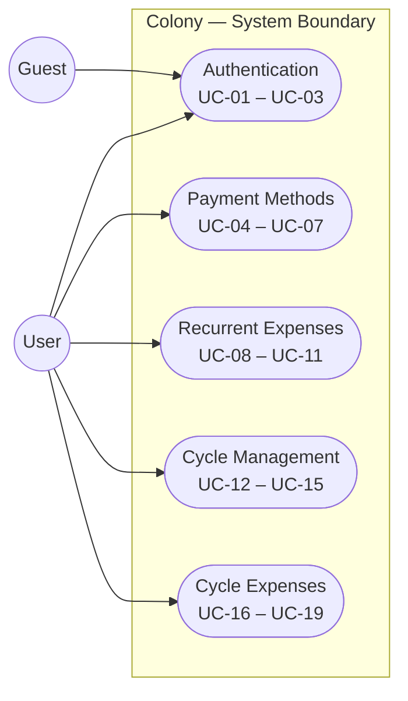
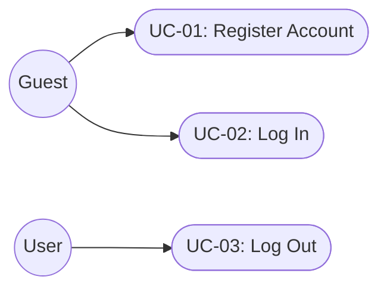
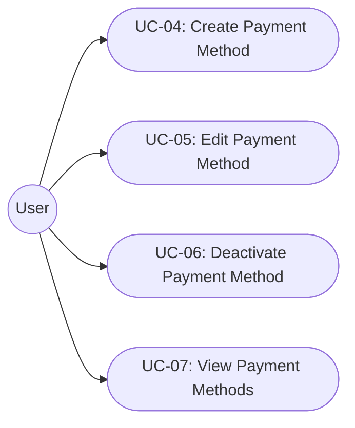
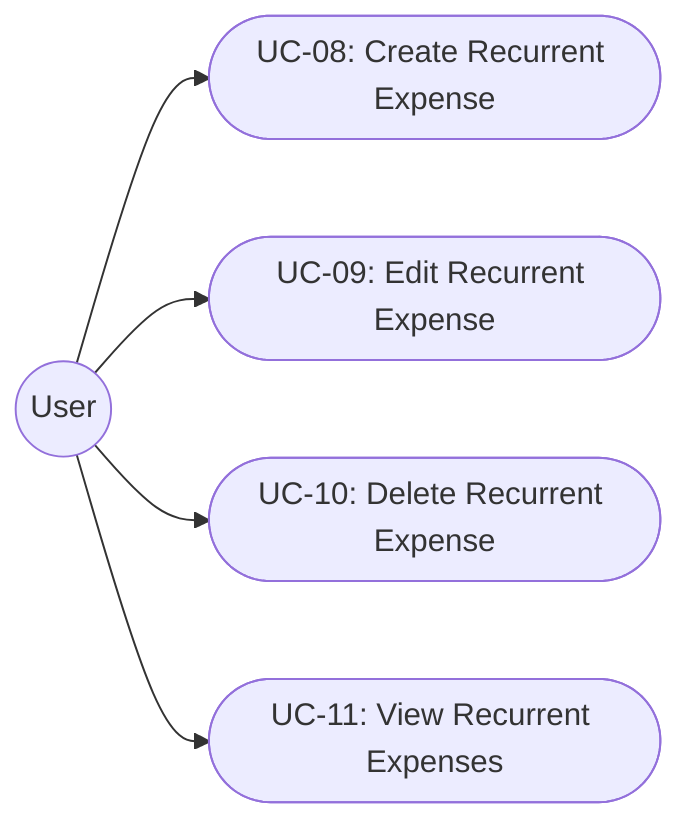
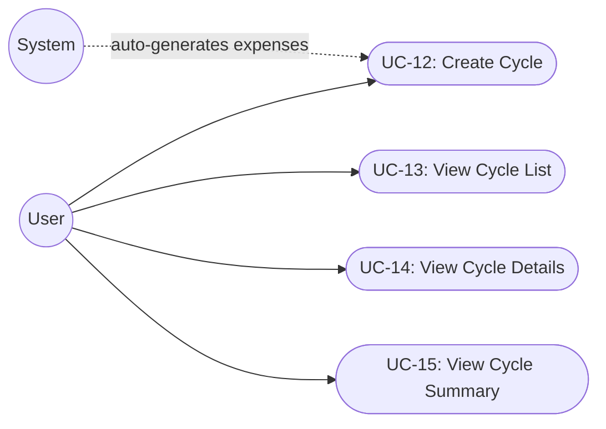
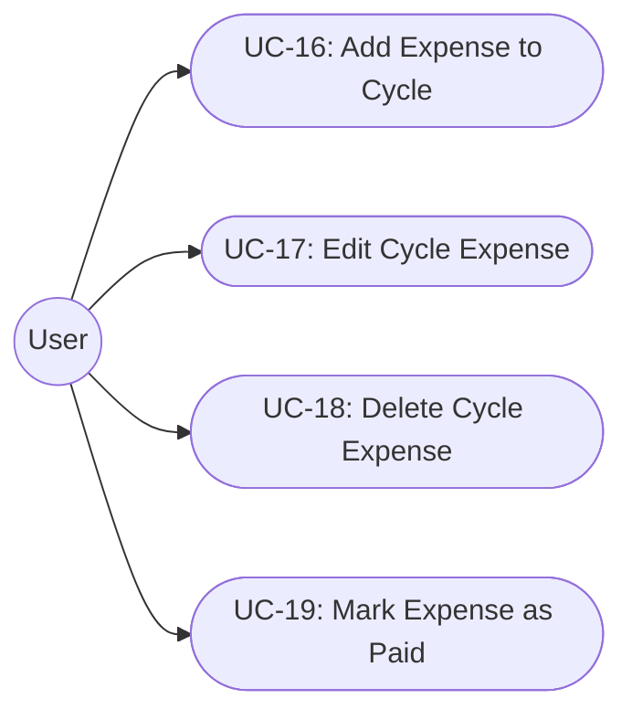

# Use Case Specification

This document describes the use cases for Colony — the specific goals a user
can accomplish through the application and the step-by-step flows to achieve
them. Use cases complement the [Software Requirements Specification](requirements.md)
by describing the *how*, not just the *what*.

Each use case references the functional requirements it satisfies (FR-###).

---

## Actors

| Actor | Description |
|---|---|
| **User** | An authenticated individual managing their personal expenses |
| **Guest** | An unauthenticated visitor (can only register or log in) |
| **System** | Automated behavior triggered by user actions or schedules |

---

## Use Case Index

| ID | Name | Actor |
|---|---|---|
| [UC-01](#uc-01-register-account) | Register Account | Guest |
| [UC-02](#uc-02-log-in) | Log In | Guest |
| [UC-03](#uc-03-log-out) | Log Out | User |
| [UC-04](#uc-04-create-payment-method) | Create Payment Method | User |
| [UC-05](#uc-05-edit-payment-method) | Edit Payment Method | User |
| [UC-06](#uc-06-deactivate-payment-method) | Deactivate Payment Method | User |
| [UC-07](#uc-07-view-payment-methods) | View Payment Methods | User |
| [UC-08](#uc-08-create-recurrent-expense) | Create Recurrent Expense | User |
| [UC-09](#uc-09-edit-recurrent-expense) | Edit Recurrent Expense | User |
| [UC-10](#uc-10-delete-recurrent-expense) | Delete Recurrent Expense | User |
| [UC-11](#uc-11-view-recurrent-expenses) | View Recurrent Expenses | User |
| [UC-12](#uc-12-create-cycle) | Create Cycle | User |
| [UC-13](#uc-13-view-cycle-list) | View Cycle List | User |
| [UC-14](#uc-14-view-cycle-details) | View Cycle Details | User |
| [UC-15](#uc-15-view-cycle-summary) | View Cycle Summary | User |
| [UC-16](#uc-16-add-expense-to-cycle) | Add Expense to Cycle | User |
| [UC-17](#uc-17-edit-cycle-expense) | Edit Cycle Expense | User |
| [UC-18](#uc-18-delete-cycle-expense) | Delete Cycle Expense | User |
| [UC-19](#uc-19-mark-expense-as-paid) | Mark Expense as Paid | User |

---

## System Overview Diagram

The following diagram shows all actors and the functional areas they interact
with. Each area maps to the detailed sections below.

---

## Authentication

### UC-01: Register Account

**Actor:** Guest

**Related Requirements:** FR-001

**Preconditions:** The user does not have an existing account.

**Main Flow:**

1. Guest submits email, password, first name, and last name.
2. System validates that the email is not already registered.
3. System hashes the password securely (Argon2ID).
4. System creates the user account.
5. System returns the user profile.

**Alternative Flows:**

- **A1 — Email already registered:** System returns a 409 error. Guest is
  prompted to log in or reset their password.
- **A2 — Invalid password format:** System returns a 422 error listing the
  violated constraints.

**Postconditions:** A new user account exists. The user can now log in.

---

### UC-02: Log In

**Actor:** Guest

**Related Requirements:** FR-002

**Preconditions:** The user has a registered account.

**Main Flow:**

1. Guest submits email and password.
2. System verifies the credentials.
3. System issues a JWT access token.
4. Guest receives the token and is now authenticated.

**Alternative Flows:**

- **A1 — Wrong credentials:** System returns a 401 error. No token is issued.
- **A2 — Inactive account:** System returns a 403 error.

**Postconditions:** The user holds a valid JWT token required by all subsequent
use cases.

---

### UC-03: Log Out

**Actor:** User

**Related Requirements:** FR-002

**Preconditions:** The user is logged in.

**Main Flow:**

1. User discards the JWT token client-side.
2. Subsequent requests without a valid token are rejected with 401.

**Notes:** Colony uses stateless JWT auth; there is no server-side token
invalidation. Expiry is enforced by the token TTL.

---

## Payment Methods

### UC-04: Create Payment Method

**Actor:** User

**Related Requirements:** FR-007, FR-012, FR-016

**Preconditions:** User is authenticated.

**Main Flow:**

1. User submits a payment method with: name, type (debit/credit/cash/transfer),
   and default currency (USD/MXN).
2. System validates that the name is unique for this user.
3. System creates the payment method with `active: true`.
4. System returns the created payment method.

**Alternative Flows:**

- **A1 — Duplicate name:** System returns a 409 error.
- **A2 — Invalid type/currency combination:** System returns a 422 error.

**Postconditions:** The new payment method is available for selection when
creating recurrent expenses and cycle expenses.

---

### UC-05: Edit Payment Method

**Actor:** User

**Related Requirements:** FR-008

**Preconditions:** User is authenticated. The payment method exists and belongs to the user.

**Main Flow:**

1. User submits updated fields (name, type, default currency, description).
2. System validates the changes.
3. System updates the payment method and returns the updated record.

**Alternative Flows:**

- **A1 — Payment method not found:** System returns a 404 error.
- **A2 — Name conflict with another existing method:** System returns a 409
  error.

**Postconditions:** The payment method reflects the new values. Existing
expenses that reference this method are unaffected (they store a snapshot or
reference by ID).

---

### UC-06: Deactivate Payment Method

**Actor:** User

**Related Requirements:** FR-009, FR-013, FR-014

**Preconditions:** User is authenticated. The payment method exists and belongs to the user.

**Main Flow:**

1. User requests deactivation of a payment method.
2. System sets `active: false` (soft delete — historical data is preserved).
3. System returns the updated payment method.

**Alternative Flows:**

- **A1 — Payment method not found:** System returns a 404 error.

**Postconditions:** The payment method no longer appears in selectors for new
expense creation but remains visible in historical expense data.

---

### UC-07: View Payment Methods

**Actor:** User

**Related Requirements:** FR-017

**Preconditions:** User is authenticated.

**Main Flow:**

1. User requests the list of payment methods.
2. System returns all payment methods belonging to the user (active and
   inactive), ordered by name.

**Notes:** The frontend may filter by `active: true` to populate form dropdowns,
and show all records in management screens.

---

## Recurrent Expenses

### UC-08: Create Recurrent Expense

**Actor:** User

**Related Requirements:** FR-018, FR-019, FR-023

**Preconditions:** User is authenticated. At least one payment method exists.

**Main Flow:**

1. User submits a template with: description, currency, payment method ID,
   amount, category (fixed/variable), and recurrence pattern.
2. System validates all fields including the recurrence config structure.
3. System creates the template with `active: true`.
4. System returns the created template.

**Recurrence Config Examples:**

| Pattern | Config |
|---|---|
| Weekly (every Saturday) | `{"type": "weekly", "day_of_week": 6}` |
| Bi-weekly (every 14 days) | `{"type": "bi-weekly", "interval_days": 14}` |
| Monthly (on the 15th) | `{"type": "monthly", "day_of_month": 15}` |
| Custom (every 30 days) | `{"type": "custom", "interval_days": 30}` |

**Alternative Flows:**

- **A1 — Payment method not found or inactive:** System returns a 404/422 error.
- **A2 — Invalid recurrence config:** System returns a 422 error describing the
  expected structure.

**Postconditions:** The template will be used to auto-generate expenses when a
new cycle is created (UC-12).

---

### UC-09: Edit Recurrent Expense

**Actor:** User

**Related Requirements:** FR-020

**Preconditions:** User is authenticated. The template exists and belongs to the user.

**Main Flow:**

1. User submits updated fields.
2. System validates the changes.
3. System updates the template and returns the updated record.

**Notes:** Editing a template does not retroactively modify expenses already
generated in past cycles. It only affects future cycle generation.

**Alternative Flows:**

- **A1 — Template not found:** System returns a 404 error.

**Postconditions:** Future cycles created after this edit will use the new
template values.

---

### UC-10: Delete Recurrent Expense

**Actor:** User

**Related Requirements:** FR-021

**Preconditions:** User is authenticated. The template exists and belongs to the user.

**Main Flow:**

1. User requests deletion of a template.
2. System soft-deletes the template (`active: false`).
3. System confirms deletion.

**Alternative Flows:**

- **A1 — Template not found:** System returns a 404 error.

**Postconditions:** The template is excluded from future cycle generation.
Cycle expenses previously generated from this template are unaffected.

---

### UC-11: View Recurrent Expenses

**Actor:** User

**Related Requirements:** FR-022

**Preconditions:** User is authenticated.

**Main Flow:**

1. User requests the list of recurrent expenses.
2. System returns all recurrent expenses belonging to the user, including
   recurrence pattern details and linked payment method info.

---

## Cycle Management

### UC-12: Create Cycle

**Actor:** User

**Related Requirements:** FR-024, FR-025, FR-028

**Preconditions:** User is authenticated.

**Main Flow:**

1. User provides a start date (and optionally an income amount and remaining
   balance).
2. System calculates the end date as `start_date + 6 weeks - 1 day`.
3. System creates the cycle record.
4. System queries all active recurrent expenses for the user.
5. System generates cycle expenses from each template, computing the expense
   date based on the template's recurrence config and the cycle's start date.
6. System returns the created cycle along with the count of generated expenses.

**Alternative Flows:**

- **A1 — Overlapping cycle dates:** System returns a 409 error if a cycle with
  overlapping dates already exists for this user.
- **A2 — No active templates:** Cycle is created with zero auto-generated
  expenses. User can add expenses manually (UC-16).

**Postconditions:** A 6-week cycle exists. Expenses derived from templates are
ready for review and modification.

---

### UC-13: View Cycle List

**Actor:** User

**Related Requirements:** FR-029

**Preconditions:** User is authenticated.

**Main Flow:**

1. User requests the list of cycles.
2. System returns all cycles for the user, ordered by start date descending,
   including status and date range for each.

---

### UC-14: View Cycle Details

**Actor:** User

**Related Requirements:** FR-026, FR-029

**Preconditions:** User is authenticated. The cycle exists and belongs to the user.

**Main Flow:**

1. User requests details for a specific cycle by ID.
2. System returns the cycle record plus the full list of associated expenses,
   each with payment method info, paid status, category, and currency.

---

### UC-15: View Cycle Summary

**Actor:** User

**Related Requirements:** FR-039, FR-040, FR-041

**Preconditions:** User is authenticated. The cycle exists and belongs to the user.

**Main Flow:**

1. User requests the summary for a specific cycle.
2. System aggregates all cycle expenses and returns:
    - **Income** for the period
    - **Fixed expenses total** (USD)
    - **Variable expenses total** (USD)
    - **USA expenses total** (USD currency expenses only)
    - **Mexico expenses total** (MXN expenses converted to USD)
    - **Total expenses** (fixed + variable)
    - **Net balance** (income − total expenses)
    - **Per payment method breakdown**: amount needed, paid, and pending

**Notes:** MXN amounts are converted using the stored exchange rate for the
cycle period.

---

## Cycle Expenses

### UC-16: Add Expense to Cycle

**Actor:** User

**Related Requirements:** FR-030, FR-023

**Preconditions:** User is authenticated. The cycle exists and belongs to the user.

**Main Flow:**

1. User submits an expense with: description, currency, payment method ID,
   amount, date, category, and optionally autopay info and comments.
2. System validates that the date falls within the cycle's start/end range.
3. System creates the expense and associates it with the cycle.
4. System returns the created expense.

**Alternative Flows:**

- **A1 — Date outside cycle range:** System returns a 422 error.
- **A2 — Payment method not found:** System returns a 404/422 error.

**Postconditions:** The expense is included in cycle totals and reports.

---

### UC-17: Edit Cycle Expense

**Actor:** User

**Related Requirements:** FR-031

**Preconditions:** User is authenticated. The expense exists within a cycle belonging to the user.

**Main Flow:**

1. User submits updated fields for the expense.
2. System validates the changes (date still within cycle range, valid payment
   method, etc.).
3. System updates the expense and returns the updated record.

**Alternative Flows:**

- **A1 — Expense not found:** System returns a 404 error.
- **A2 — Cycle is closed/completed:** System may reject edits to prevent
  retroactive changes to completed cycles.

---

### UC-18: Delete Cycle Expense

**Actor:** User

**Related Requirements:** FR-032

**Preconditions:** User is authenticated. The expense exists within a cycle belonging to the user.

**Main Flow:**

1. User requests deletion of a specific cycle expense.
2. System soft-deletes the expense (`active: false`).
3. System confirms deletion.

**Postconditions:** The expense is excluded from future cycle totals and
reports.

---

### UC-19: Mark Expense as Paid

**Actor:** User

**Related Requirements:** FR-033

**Preconditions:** User is authenticated. The expense exists within a cycle belonging to the user.

**Main Flow:**

1. User toggles the paid status of an expense.
2. System updates `paid: true` (or `false` to reverse).
3. System returns the updated expense.

**Postconditions:** The cycle summary (UC-15) reflects the updated paid/pending
amounts per payment method.

---

## Out of Scope (Planned for Future Phases)

The following use cases are identified in the requirements but are not yet
implemented and are excluded from the initial frontend build:

| Use Case | Related Requirements |
|---|---|
| Reset Password | FR-003 |
| Import from Excel/CSV | FR-045, FR-046 |
| Currency Exchange Rate Management | FR-004, FR-005, FR-006 |
| Multi-period Summary / Period Comparison | FR-042, FR-043 |
| Recurrent Expense Recurrence Config via UI Wizard | FR-019 |
